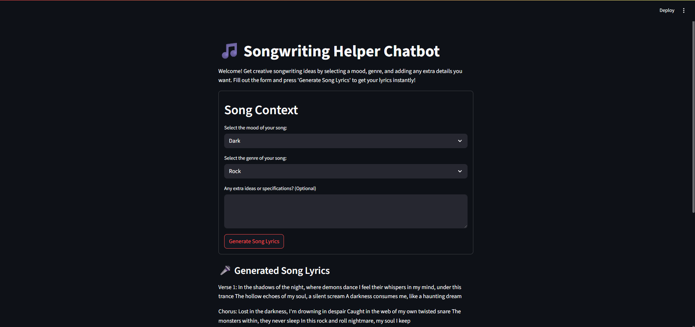
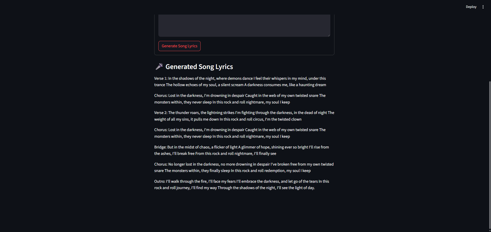
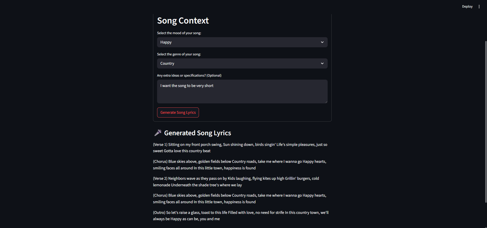

# 🎶 LyricCrafter – Your AI-Powered Songwriting Companion

**LyricCrafter** is a Streamlit-powered AI chatbot that helps songwriters and music enthusiasts instantly generate creative song lyrics. Just pick a **mood**, select a **genre**, add any **extra ideas**, and let the AI craft original lyrics for you.

---

---

## ✨ Features

- 🎼 Generate unique song lyrics in seconds
- 🎭 Choose from multiple moods and genres
- 🧠 Powered by OpenAI's large language models via LangChain
- ✍️ Add custom ideas or themes to personalize your song
- 🧰 Easy-to-use Streamlit interface

---

## 🚀 Demo

  
<!-- You can add your own GIF or screenshot of the app running -->

🛠️ Tech Stack
Streamlit – UI & web framework
LangChain – Prompt chaining & parsing
OpenAI GPT – Core language model
Python – Core language
dotenv – Manage environment variables
